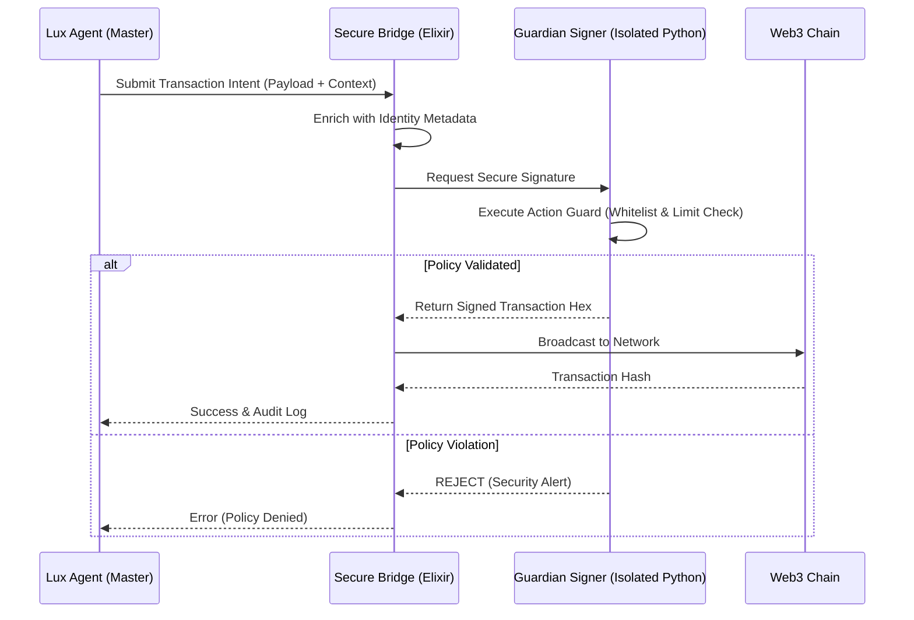
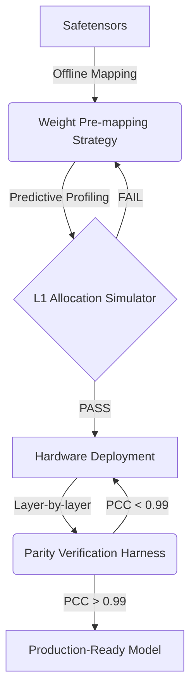

# McCoy Labs: High-Performance Agentic Infrastructure

McCoy Labs is a specialized research and engineering entity focused on the intersection of **AI Agent Autonomy**, **Web3 Security**, and **Hardware-Native Inference**. This repository serves as a technical whitepaper and structural showcase for our production paradigms.

---

## 🎯 Our Mission
To bridge the gap between high-level LLM reasoning and low-level system reliability. We solve the "last mile" problems of AI agents: security isolation, hardware-native performance, and deterministic orchestration.

---

## 🏗️ Architectural Blueprints

### 1. Dual-Layer Security Isolation (Master-Guardian)
**Problem:** Directly exposing private keys to LLM-orchestrated business logic creates an unacceptable attack surface for prompt injection and unauthorized execution.

**Solution:** A strict decoupling of "Intent" from "Execution" via a verified bridge protocol.

**Design Rationale:** We learned from multiple DeFi exploits that single-context agents are vulnerable. Our Guardian layer runs in a zero-network-access container, communicating only via the Elixir-Python bridge, making private key exfiltration virtually impossible.

### 2. SOP-Driven AI Model Bring-up
**Problem:** Porting LLMs to specialized accelerators (e.g., Tenstorrent Wormhole) often fails due to opaque SRAM/L1 fragmentation and numerical drift.

**Solution:** A 4-stage pipeline that ensures "First-Time Right" deployment.

**Design Rationale:** In the Tenstorrent ecosystem, compile-time failures are costly. By simulating tensor layouts offline using our `l1_profiler`, we reduce hardware debugging time by 75%.

---

## 📂 Repository Structure

- `/web3/`: Interface definitions for secure transaction flows.
- `/ai_infra/`: Abstract protocols for model bring-up and optimization.
- `/system/`: Patterns for resilient server orchestration.
- `/tests/`: **The Proof of Engineering.** Detailed test harnesses for edge-case validation.
- `UTILITIES.md`: Production-ready, verified tools for developers.

---

## 🛠️ Featured Utilities (Verified Production-Ready)

Check our [**UTILITIES.md**](./UTILITIES.md) for free-to-use, high-impact tools:
- **Multi-Chain RPC Health Guard**: Latency-based node rotation.
- **CUDA Zombie Killer**: Precision GPU memory recovery.
- **Predictive SRAM Profiler**: Hardware-aware memory analysis.

---

## ⚖️ Intellectual Property & Licensing

### 1. Open Source Licensing
The structural frameworks and utilities provided in this repository are licensed under the **MIT License**. You are free to use, modify, and distribute them provided the original copyright notice is retained.

### 2. IP Protection (Clean Room Policy)
- All logic presented here is **Original Work** or derived from public standards/specifications. 
- We strictly adhere to a **Clean Room Design** policy. No code from previous clients, employers, or proprietary third-party SDKs (under NDA) is included in this repository. 
- Interface definitions for third-party hardware (e.g., Tenstorrent) are designed for compatibility and do not contain restricted implementation details or proprietary binaries.

### 3. Bounty Assignments & IP Transfer
When McCoy Labs is assigned to a specific GitHub Bounty or client project:
- The specific implementation delivered for that project (the "Deliverable") is granted under the project's required license (e.g., Apache 2.0/MIT).
- McCoy Labs retains all rights to the underlying, general-purpose architectural patterns and pre-existing modules used to build the deliverable.

---
**Contact & Assignments**: We are active on GitHub Bounty boards. For formal assignments or architecture consulting, please reach out via a project issue or contact our Lead Architect.

*McCoy Labs - Where 운산 (Compute) meets 영혼 (Soul).*
